### Crear el proyecto

para crear el proyecto usamos el comando:

```bash
npx react-native init news-mobile
```

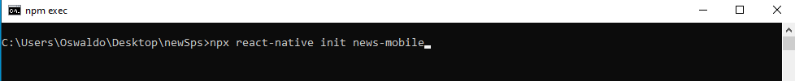

Nos marca error por el nombre, ya que no es valido.

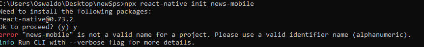

Usamos el nombre "NewsMobile"

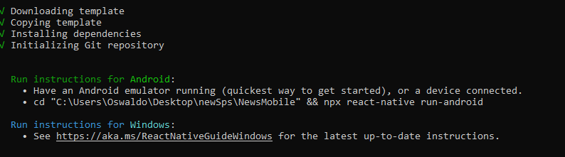

## Ejecutar el proyecto

abrir un emulador android o conectar un dispositivo fisico, se debe configurar previamente para que funcione correctamente.

### Ejecutar el servidor: metro

en la raiz del proyecto abrir una terminal y ejecutar el comando

```bash
npm start
```

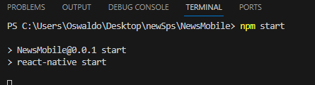

### Ejecutar la aplicacion en el emulador

en la raiz del proyecto abrir una terminal y ejecutar el comando

```bash
npm run android
```

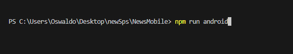

Validamos que funcione la app, y comenzamos con el desarrollo del proyecto.

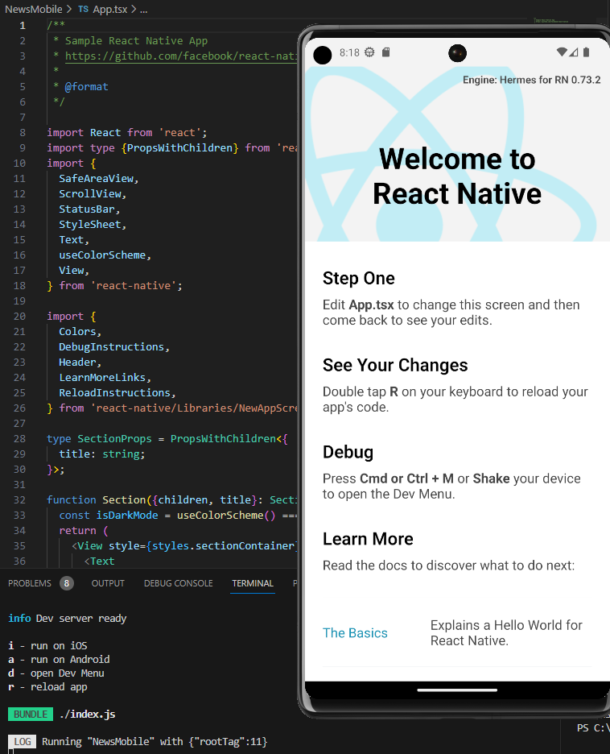

## Instalar la dependencias

para este proyecto se ocuparon la dependencia de react-navigation para navegar entre pantallas.

### Seguir la documentacion oficial de react navigation

Documentacion oficial: [React Native](https://reactnavigation.org/docs/getting-started)

```bash
npm install @react-navigation/native
npm install react-native-screens react-native-safe-area-context
npm install @react-navigation/native-stack
```

## Crear las pantallas

por ahora las cree directamente en el archivo APP.tsx para ver que todo funcione bien

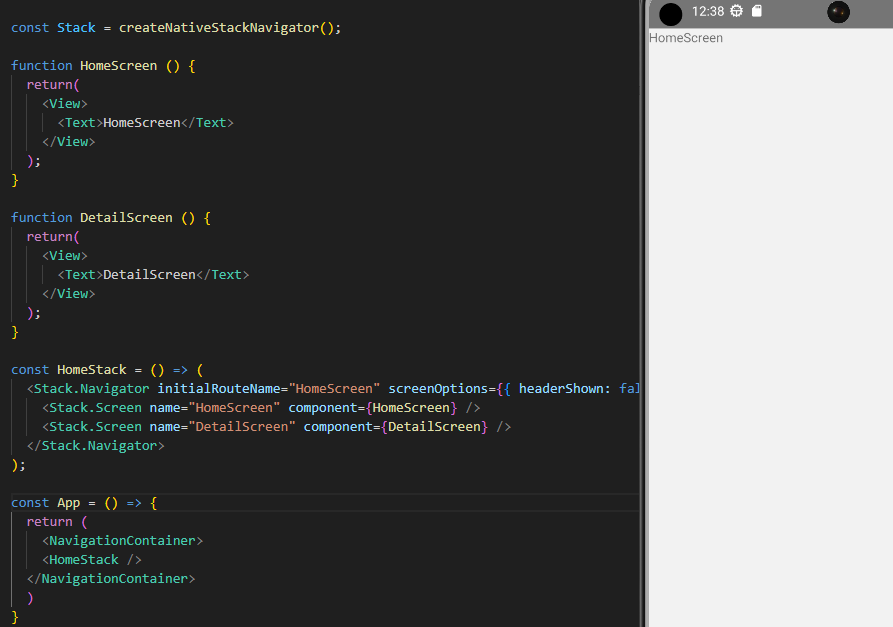

### Crear la estructura del proyecto

Carpetas
Screens: se crearan todas las pantallas individualmente

Navigation: se creara un archivo para la navegacion de la app.

hooks: se crearan hooks personalizados.

components: se crearan componentes personalizados y reutilizables.

assets: se guardaran archivos como: imagenes

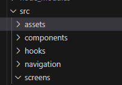

una vez creados los archivos

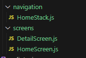

en el archivo HomeStack creamos nuestro stack con las pantallas que usaremos, en un futuro se pueden ir agregando mas pantallas.

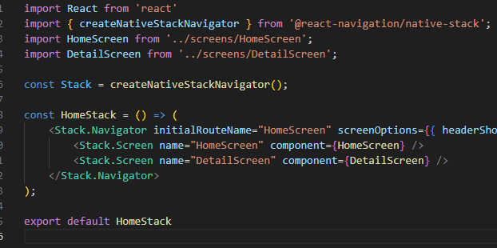

actualizamos App.tsx. y queda de la siguiente manera

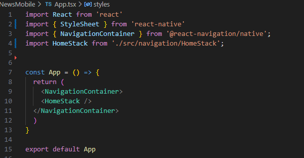

## Pantalla HomeScreen

Empezamos a modificar HomeScreen que es donde vamos a mostrar los datos obtenidos de la api.

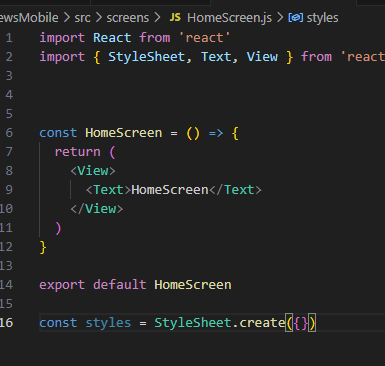

### Crear Card

Creamos una card como se muestra en la imagen del documento de la prueba.

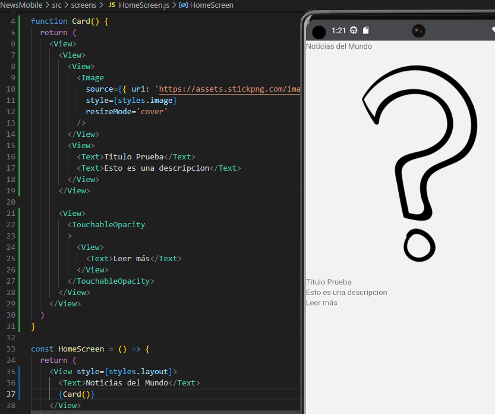

Agregamos estilos, en este caso fueron estilos in-line

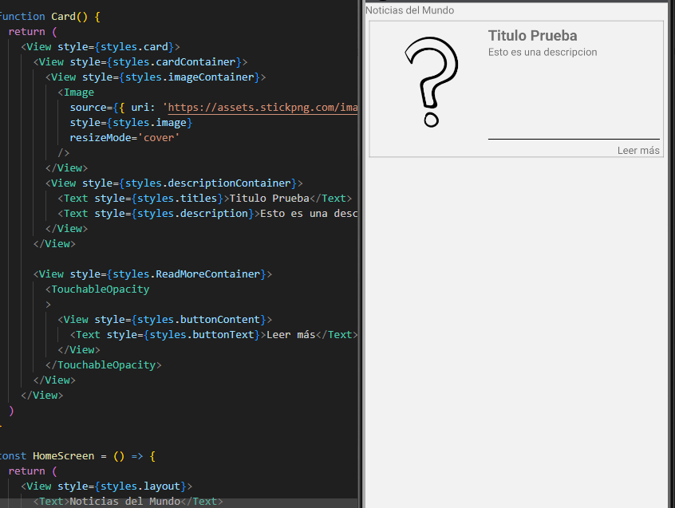

## Obtener Datos de la api

### Instalar axios

instalamos axios y lo importamos a HomeScreen.js

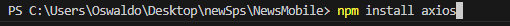

### Creamos la funcion para obtener los datos

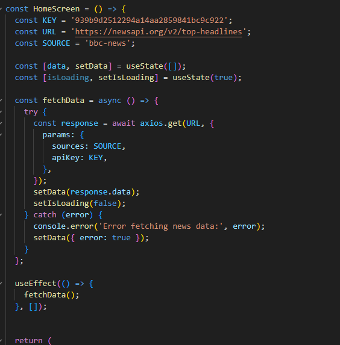

### Pasamos por parametro un articulo para verificar la data

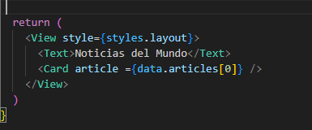

### Hacemos los ajustes pertinentes para mostrar la informacion correctamente

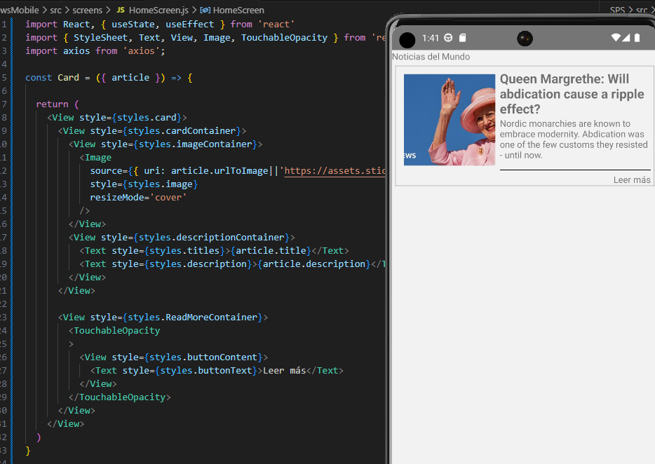

### Creamos un FlatList para asi crear Card segun sea el tamaño de la data

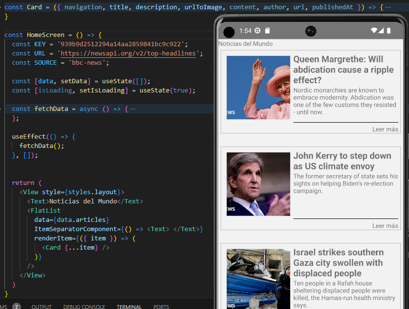

### Pantalla de detalle


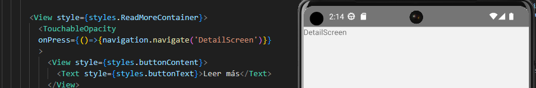

## Abstraer los componentes de HomeScreen para una mejor visualizacion

Asi va quedando la estructura de nuestros archivos.
se creo Card que es un componente reutilizable,
en UseGetNews abstraimos la logica que obtiene la data de la API del componente para que sea mas facil escalarlo.

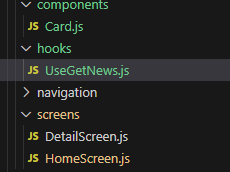

al final nos queda un componente HomeScreen limpio

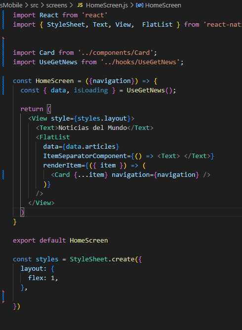

## Pasar informacion de la noticia

por parametros pasaremos la informacion de la noticia del componente Card a la pantalla DetailScreen

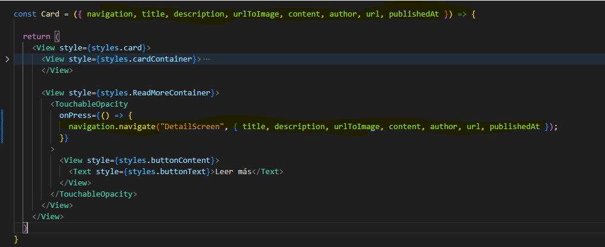

## Pantalla DetailScreen

Comenzamos a editar y estilar la pantalla DetailScreen

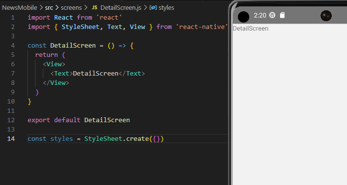

Al final queda asi la pantalla DetailScreen

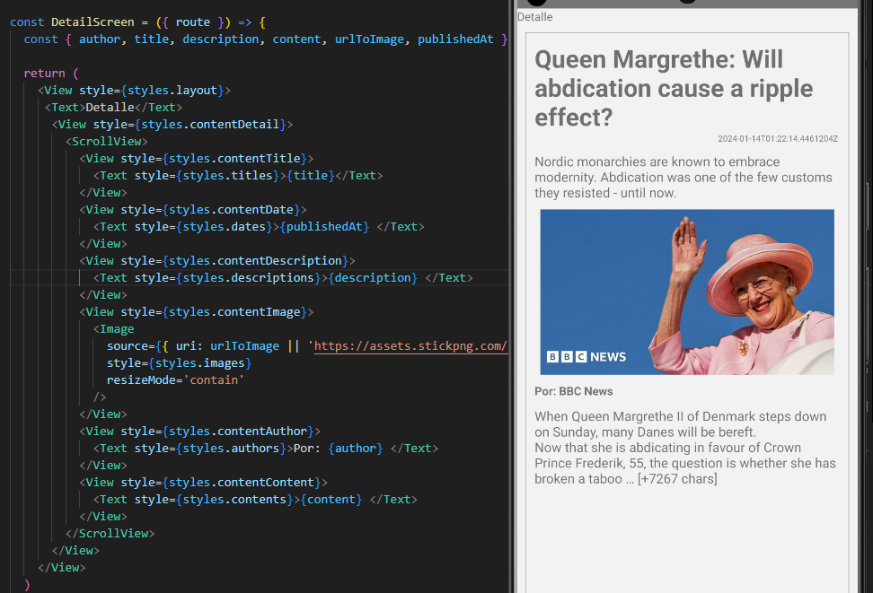

## Crear una barra de titulo

se creo un componente que servira como barra de titulo y tendra un icono para hacer la funcion de "Back"

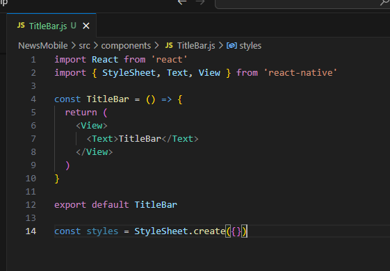

Queda de esta manera, recibe un parametro que es el titulo de la pantalla.
de igual manera tene un icono que nos ayuda con la funcion de "back"

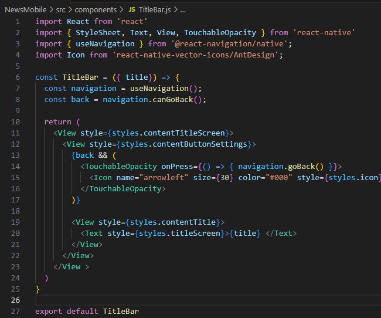

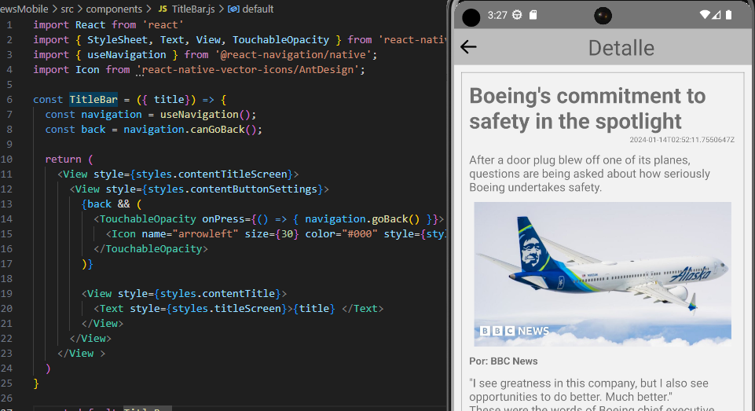


## Crear una pantalla de presentacion (SplashScreen)

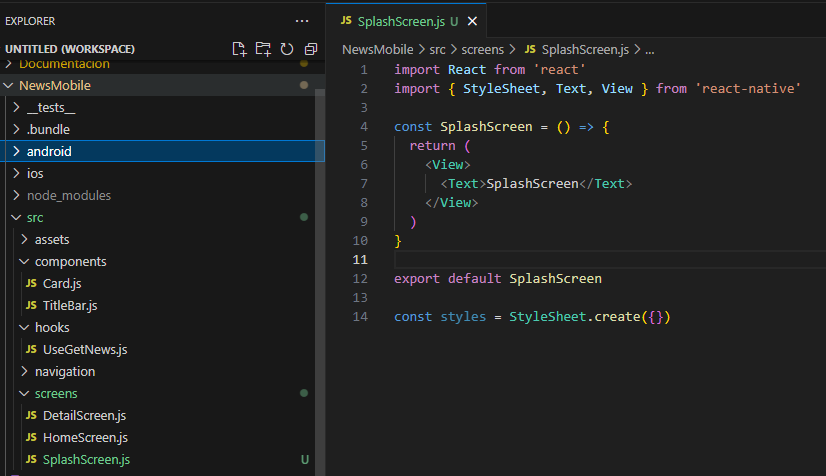

asi queda la splash screen, se debe importar a HomeScreen

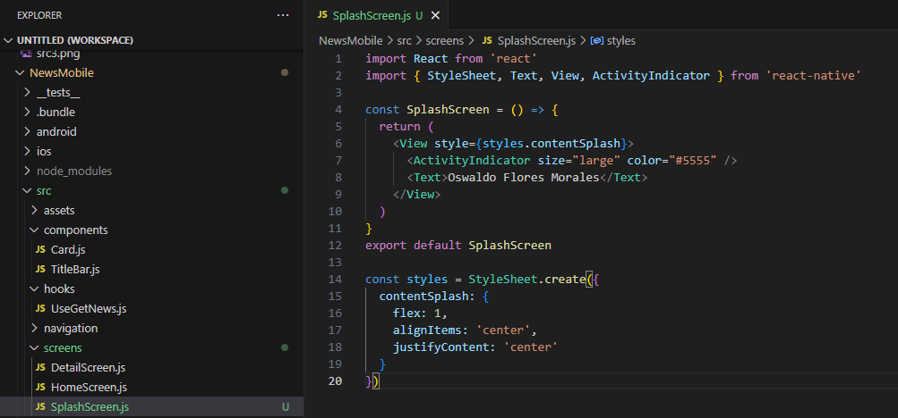

Carga un Loader hasta que se se obtiene la informacion de la API

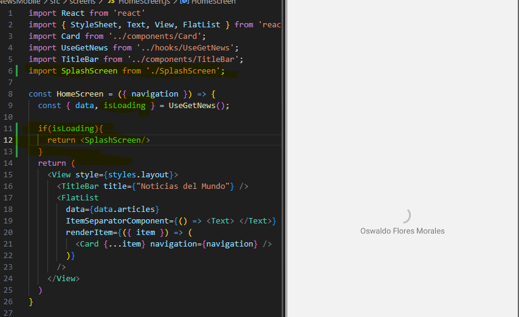

## Plus

### Cambiar de lenguaje

implementar i18next que es internationalization-framework

Documentacion oficial: [i18next](https://www.i18next.com/overview/getting-started)

## Instalar dependecias

```bash
npm install i18next
npm install react-i18next
```

## Configurar i18next

se creo una carpeta llamada "locales" en la raiz del proyecto
esta carpeta contendra dos archivos tipo .json que contendra nuestro diccionario de palabras.

solo usaremos el lenguaje de Ingles y Español

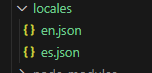

## Realizar la configuracion de i18next

Se creo una carpeta en /src/ que se llama functions.

y tambien se creo el archivo de configuracion "i18next.js"

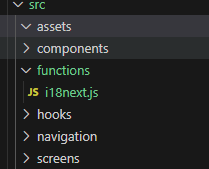

importamos las librerias, y nuestros archivos de locales

realizamos la configuracion para react y tambien podemos ver en la imagen que el idioma por defecto de la aplicacion sera en ingles.

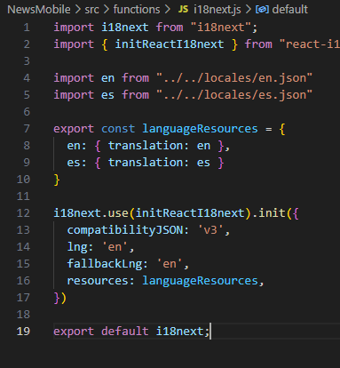

### Configurar archivos para poder hacer las traducciones

Envolvemos la aplicacion en el provaidel de i18next para que de esta manera todos los componentes tengan acceso a la condiguracion de internalizacion y traduccion

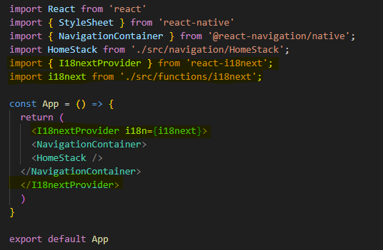

Importamos la funcion useTranslation que tiene una funcion "t" que es la que se ocupa para traducir la cadenas.

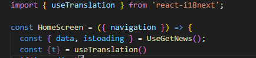

Reemplazamos las cademas de texto que se requieran traducir de la siguiente manera:

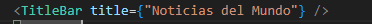

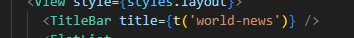

En nuestro archivos de locales debe quedar de la siguiente manera:

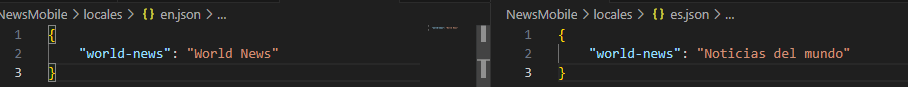

y asi agregamos todas las cadenas de texto que sean necesarias.

## Crear la pantalla de configuracion para cambiar el idioma

### Crear pantalla de configuracion

se creo una nueva pantalla de configuracion.

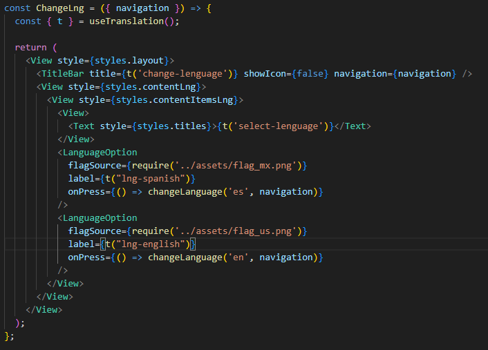

### Crear boton settings

 se creo un boton para poder acceder a la pantalla de configuracion.

 este boton se puso en la barra de titulo.

 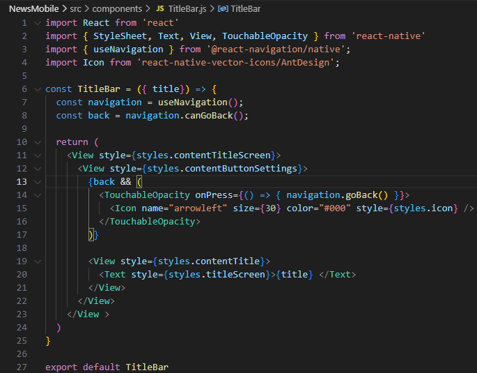

 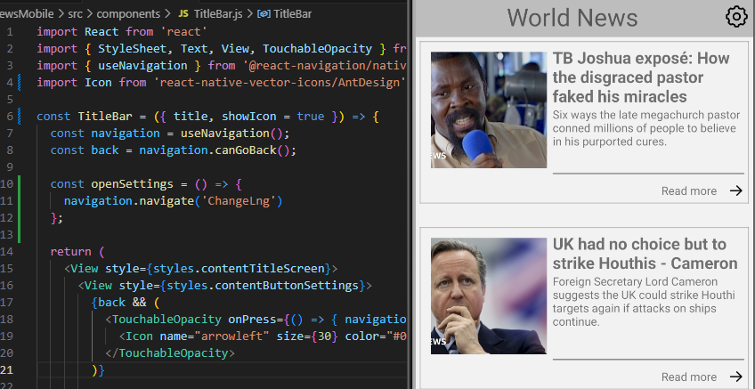

 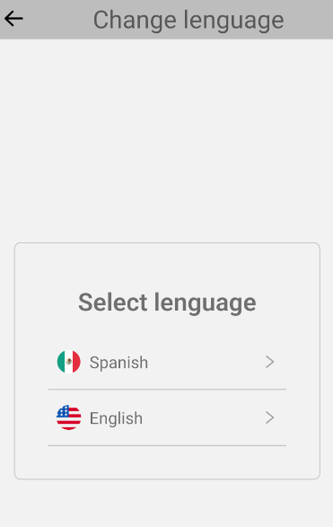